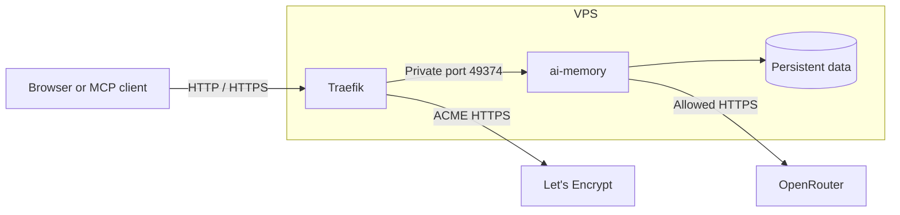

# Secure ai-memory VPS Deployment

<p align="center">
  
  <br>
  <sub>Adapted from the original ai-memory logo.</sub>
</p>

This repository helps beginners deploy [ai-memory](https://github.com/akitaonrails/ai-memory) securely on an existing Debian or Ubuntu x86_64 VPS using a personal domain.

The result is a persistent ai-memory server exposed through HTTPS. The design is intentionally small enough for a VPS with 1 vCPU, 1 GB RAM, and 30 GB SSD.

## Architecture



### What each component does

- **Browser or MCP client**: accesses the wiki, API, or MCP endpoint using the public domain and an ai-memory credential.
- **Traefik**: is the only service exposed on public ports 80 and 443. It redirects HTTP to HTTPS, obtains the TLS certificate, and forwards requests internally.
- **ai-memory**: serves the authenticated wiki, MCP transport, and API. It has no published host port and cannot be reached directly from the Internet.
- **Persistent data directory**: stores the Markdown wiki as the source of truth, plus SQLite indexes and logs.
- **OpenRouter**: is the intended external HTTPS service for ai-memory. The firewall refreshes an IP allowlist from configured OpenRouter hostnames; the IP-sharing limitation is documented below.
- **nftables**: distinguishes the two containers by their current Docker IPv4 addresses. It allows public HTTP/HTTPS to Traefik, Traefik-to-ai-memory traffic, DNS, ai-memory-to-OpenRouter HTTPS, and Traefik-to-Let's Encrypt HTTPS, then drops other traffic involving these containers.
- **Let's Encrypt**: issues a trusted certificate through the HTTP-01 challenge and Traefik renews it automatically.

## Beginner's quick start

Run these commands on your own computer, not inside the VPS, unless stated otherwise.

### 1. Prepare the VPS

This deployment is reusable on an existing VPS when it meets all of these requirements:

- Debian or Ubuntu on x86_64; other Linux families and ARM64 are not supported by this role.
- A public IPv4 address, a DNS `A` record you control, and inbound TCP ports 80 and 443 available for Traefik and Let's Encrypt.
- SSH access as `root`, initially through a temporary password or the provider console so the bootstrap script can install a key.
- At least 1 vCPU, 1 GB RAM, and 30 GB of storage for the documented sizing target.
- An OpenRouter account, an API key, and credits if the selected model is not free.

Create or select a VPS that meets those requirements. You need its public IP address and temporary root password or console access.

Test the initial connection:

```bash
ssh root@YOUR_VPS_IP
```

On the VPS, confirm the operating system and resources:

```bash
cat /etc/os-release
uname -m
free -h
df -h /
```

Leave the VPS:

```bash
exit
```

### 2. Configure DNS

At your DNS provider, create an `A` record:

```text
Name: ai-memory
Type: A
Value: YOUR_VPS_IP
```

This creates `ai-memory.YOUR_DOMAIN`. This deployment is IPv4-only; do not create an `AAAA` record for this subdomain.

Check the record:

```bash
dig +short ai-memory.YOUR_DOMAIN
```

It must return the VPS IP before Let's Encrypt can issue a certificate.

### 3. Install local tools

On Debian or Ubuntu:

```bash
sudo apt update
sudo apt install -y git ansible-core openssh-client sshpass
```

On Fedora:

```bash
sudo dnf install -y git ansible-core openssh-clients sshpass
```

On macOS with Homebrew:

```bash
brew install git ansible openssh
```

Ansible is installed on your computer. It connects to the VPS over SSH; Ansible does not need to be installed on the VPS.

### 4. Configure this repository

From the cloned repository:

```bash
cp ansible/inventory/hosts.example.yml ansible/inventory/hosts.yml
cp ansible/group_vars/all.example.yml ansible/group_vars/all.yml
```

Edit `ansible/inventory/hosts.yml` and set:

```yaml
all:
  hosts:
    ai_memory_vps:
      ansible_host: YOUR_VPS_IP
      ansible_user: root
```

Edit `ansible/group_vars/all.yml` and set at least:

```yaml
public_domain: ai-memory.YOUR_DOMAIN
letsencrypt_email: YOUR_REAL_EMAIL
```

### 5. Create secrets

```bash
./scripts/generate-secrets.sh
nano secrets/openrouter-api-key
chmod 600 secrets/openrouter-api-key
./scripts/validate-secrets.sh
```

Create an OpenRouter API key at <https://openrouter.ai/settings/keys>, paste only the key into `secrets/openrouter-api-key`, and do not add quotes or a variable name. The `secrets/` directory is ignored by Git. Never commit or paste these files into chat.

### 6. Install your SSH key and deploy

```bash
./scripts/bootstrap-ssh-and-deploy.sh
```

The script reads the VPS address from `ansible/inventory/hosts.yml`. If `~/.ssh/id_ed25519` already works, it does not ask for a password or generate another key. Otherwise it offers to use the existing public key or create a new ED25519 key. The first installation may require the temporary root password.

The same script then validates the local files and secrets and runs Ansible automatically. It installs Docker, starts Traefik and ai-memory, and never prints secret values.

### 7. Open the service

Visit:

```text
https://ai-memory.YOUR_DOMAIN/web
```

Use the initial bearer token from `secrets/ai-memory-auth-token`. Create human users and API keys using the ai-memory CLI. Preserve the token pepper permanently; changing it invalidates native `aim_` API keys.

## Install the local Codex client

The VPS installation provides the remote server. The Codex hooks, skills, and `AGENTS.md` must be installed on the computer where Codex runs. The single helper below installs the native ai-memory binary, verifies its checksum, and configures the global user-level Codex files:

```bash
./scripts/install-local-client.sh
```

It asks for the remote server URL and reads `secrets/ai-memory-auth-token` by default. The generated locations are:

```text
~/.local/bin/ai-memory
~/.ai-memory/hooks/
~/.agents/skills/
~/.codex/AGENTS.md
~/.codex/config.toml   # MCP configuration, if generated or merged separately
```

The installer supports Linux x86_64 and aarch64. Set `AI_MEMORY_VERSION` to install another published version, or `AI_MEMORY_TOKEN_FILE` to use a token file outside this repository.

## Configuration reference

Edit non-secret values in `ansible/group_vars/all.yml`.

| Variable | Purpose | Example |
|---|---|---|
| `deployment_dir` | Remote installation and persistent-data directory. | `/opt/ai-memory` |
| `public_domain` | Public DNS name used by Traefik and ai-memory host validation. | `ai-memory.example.com` |
| `letsencrypt_email` | ACME account contact. | `admin@example.com` |
| `ai_memory_image` | Pinned ai-memory image tag. | `akitaonrails/ai-memory:1.21.0` |
| `traefik_image` | Pinned Traefik image tag. | `traefik:v3.3` |
| `ai_memory_bind` | Internal listen address. | `0.0.0.0:49374` |
| `ai_memory_llm_provider` | Provider type. | `openai-compat` |
| `openrouter_base_url` | OpenRouter API base URL. | `https://openrouter.ai/api/v1` |
| `ai_memory_llm_model` | Model used for consolidation. | `moonshotai/kimi-k2.5` |
| `ai_memory_llm_timeout_secs` | Maximum provider request time. | `300` |
| `ai_memory_consolidate_on_session_end` | Optional session-end LLM work. | `false` |
| `ai_memory_memory_limit` | Docker memory limit. | `384m` |
| `ai_memory_cpus` | Docker CPU quota. | `0.75` |
| `traefik_memory_limit` | Traefik memory limit. | `128m` |
| `traefik_cpus` | Traefik CPU quota. | `0.25` |
| `openrouter_hostnames` | Hostnames resolved into the ai-memory HTTPS allowlist. | `[openrouter.ai]` |
| `letsencrypt_hostnames` | Hostnames resolved into the Traefik ACME HTTPS allowlist. | `[acme-v02.api.letsencrypt.org]` |

Required secret files:

| File | Purpose |
|---|---|
| `secrets/ai-memory-auth-token` | Initial bearer/root token. |
| `secrets/ai-memory-token-pepper` | Hashing pepper for native API keys. Preserve it. |
| `secrets/openrouter-api-key` | OpenRouter API credential. |

## Scripts reference

### `scripts/generate-secrets.sh`

Creates missing authentication-token and token-pepper files using `openssl rand`, never overwrites existing files, and sets mode `0600`. It does not create the OpenRouter key.

### `scripts/validate-secrets.sh`

Checks that all three secret files exist, are non-empty, and have mode `0600`.

### `scripts/bootstrap-ssh-and-deploy.sh`

Reads the host from the inventory unless an optional argument is supplied, checks the local SSH key, optionally creates an ED25519 key, uses `ssh-copy-id` when necessary, validates key-only access, validates local files, and runs the Ansible playbook. It writes secrets to a temporary `0600` JSON variables file and removes it on exit, so secret values are not passed in the `ansible-playbook` command line.

Optional overrides:

```bash
./scripts/bootstrap-ssh-and-deploy.sh YOUR_VPS_IP
REMOTE_USER=root SSH_KEY_PATH="$HOME/.ssh/my-key" ./scripts/bootstrap-ssh-and-deploy.sh
```

## Security and network behavior

Traefik is the only component with public ports. ai-memory exposes port 49374 only inside the Docker network. Native ai-memory authentication protects the wiki, API, and MCP requests; TLS protects credentials and browser cookies in transit. Traefik uses only its file provider, so it does not receive the Docker socket.

The firewall discovers each container's current address instead of assuming a Docker subnet. Deployment first creates the stopped containers, blocks their entire Docker subnet, starts them under that deny policy, and then installs their individual allowlists. It allows ai-memory to initiate DNS and HTTPS to resolved OpenRouter addresses. Traefik can initiate DNS and HTTPS to resolved Let's Encrypt addresses and can connect to ai-memory on port 49374. New inbound TCP traffic to Traefik is limited to ports 80 and 443. Access from either container to host network services and unrelated forwarded networks is dropped, while forwarding unrelated to this deployment is left unchanged.

OpenRouter and Let's Encrypt can use changing CDN addresses, so the allowlist is refreshed hourly. Monitor it with:

```bash
ssh root@YOUR_VPS_IP 'systemctl status ai-memory-egress.timer'
ssh root@YOUR_VPS_IP 'journalctl -u ai-memory-egress.service --no-pager -n 30'
```

Keep secret files at mode `0600`, do not expose the Docker socket to either container, do not publish port 49374, and preserve the token pepper after API keys are created.

The HTTPS restriction is an IP allowlist generated from DNS, not hostname inspection. If an allowed hostname shares an IP address with another service, nftables cannot distinguish their TLS hostnames. Enforcing hostnames requires a dedicated egress proxy; this deployment documents the IP-allowlist boundary instead of claiming hostname-level isolation.

## Testing the deployment

Run local static checks before deploying:

```bash
./scripts/validate-secrets.sh
for script in scripts/*.sh; do sh -n "$script"; done
ansible-playbook --syntax-check -i ansible/inventory/hosts.example.yml ansible/site.yml
git diff --check
```

After deployment, verify HTTP, HTTPS, the containers, and the installed firewall:

```bash
curl -I http://ai-memory.YOUR_DOMAIN
curl -fsS -o /dev/null https://ai-memory.YOUR_DOMAIN/web
ssh root@YOUR_VPS_IP 'systemctl show ai-memory-egress.service -p Result -p ExecMainStatus'
ssh root@YOUR_VPS_IP 'systemctl --no-pager --full status ai-memory-egress.timer'
ssh root@YOUR_VPS_IP 'nft list table inet ai_memory_filter'
ssh root@YOUR_VPS_IP 'cd /opt/ai-memory && docker-compose ps'
```

The first response should redirect to HTTPS, the HTTPS request should succeed, both containers should be running, and nftables should show separate `openrouter_ipv4` and `letsencrypt_ipv4` sets.

Test the positive and negative ai-memory egress paths from inside its container:

```bash
ssh root@YOUR_VPS_IP "docker exec ai-memory sh -c 'timeout 10 openssl s_client -connect openrouter.ai:443 -servername openrouter.ai </dev/null >/dev/null 2>&1'"
if ssh root@YOUR_VPS_IP "docker exec ai-memory sh -c 'timeout 10 openssl s_client -connect example.com:443 -servername example.com </dev/null >/dev/null 2>&1'"; then echo "ERROR: unexpected egress"; else echo "OK: unrelated HTTPS blocked"; fi
```

The OpenRouter request should succeed and the unrelated HTTPS request should print `OK`. Finally, confirm in the browser that `/web` accepts the bearer token and perform one operation that invokes the configured LLM model.

## Operations and backups

Check services:

```bash
ssh root@YOUR_VPS_IP 'cd /opt/ai-memory && docker-compose ps'
ssh root@YOUR_VPS_IP 'docker inspect --format="{{.State.Status}}" ai-memory'
```

View logs without displaying the Compose file or secrets:

```bash
ssh root@YOUR_VPS_IP 'cd /opt/ai-memory && docker-compose logs --tail=100 ai-memory'
ssh root@YOUR_VPS_IP 'docker logs --tail=100 ai-memory-traefik'
```

Back up these paths to encrypted external storage:

```text
/opt/ai-memory/data
/opt/ai-memory/letsencrypt
/opt/ai-memory/compose.yml
/opt/ai-memory/dynamic.yml
```

The Markdown wiki is the source of truth. SQLite indexes are derived state and can be rebuilt using ai-memory's documented reindex workflow. Monitor resources:

```bash
ssh root@YOUR_VPS_IP 'df -h / && free -h'
```

If memory or API usage is high, keep embeddings disabled and leave `ai_memory_consolidate_on_session_end: "false"`.

## Updating the deployment

Change the image tag or configuration in `ansible/group_vars/all.yml`, then run:

```bash
./scripts/bootstrap-ssh-and-deploy.sh
```

Update the OpenRouter key by replacing `secrets/openrouter-api-key` and rerunning the same command. Never rotate the token pepper without understanding that native API keys will stop working.

## OpenTofu

The initial implementation assumes an existing VPS. The `opentofu/` directory documents this boundary. OpenTofu can be added later for optional provider-specific VPS provisioning without changing the Ansible workflow.
